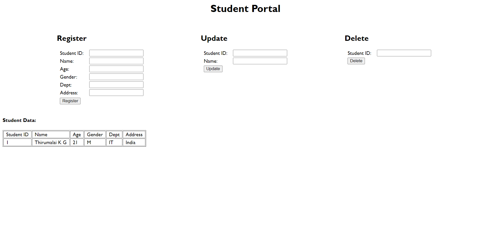
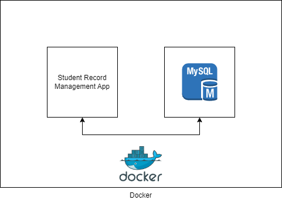

# Multicontainer-Student-Management-Portal-Using-MYSQL-and-Docker

This is an implementation of how to Containerize DB ( MYSQL ) in one container and Node JS in another container.

<h4>How to run?</h4>

<pre>docker compose up</pre>

<h4>Output</h4>

<h4>Multicontainer Diagram</h4>

<h4>Docker Compose File</h4>

<pre>
  <code> 
version: "3.8"

services: 
  app:
    build: 
      context: .
      dockerfile: Dockerfile
    ports: 
      - 3000:3000
    volumes: 
      - .:/usr/src/app
      - '/usr/src/app/node_modules'
    depends_on: 
      - mysql_server
  
  mysql_server:
    command: --default-authentication-plugin=mysql_native_password
    image: mysql:5.7
    environment: 
      - MYSQL_DATABASE=TCE
      - MYSQL_USER=thiru
      - MYSQL_PASSWORD=1234
      - MYSQL_ROOT_PASSWORD=1234
  </code>
</pre>

<h4>Dockerfile</h4>

<pre>
  <code>
# Latest Node Version
FROM node:latest
    
WORKDIR /usr/src/app

COPY package*.json .

RUN npm install

VOLUME [ "/usr/src/app/node_modules" ]

COPY . .

EXPOSE 3000

CMD ["node", "index.js"]
  </code>
</pre>
